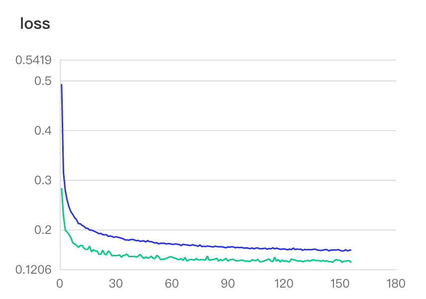
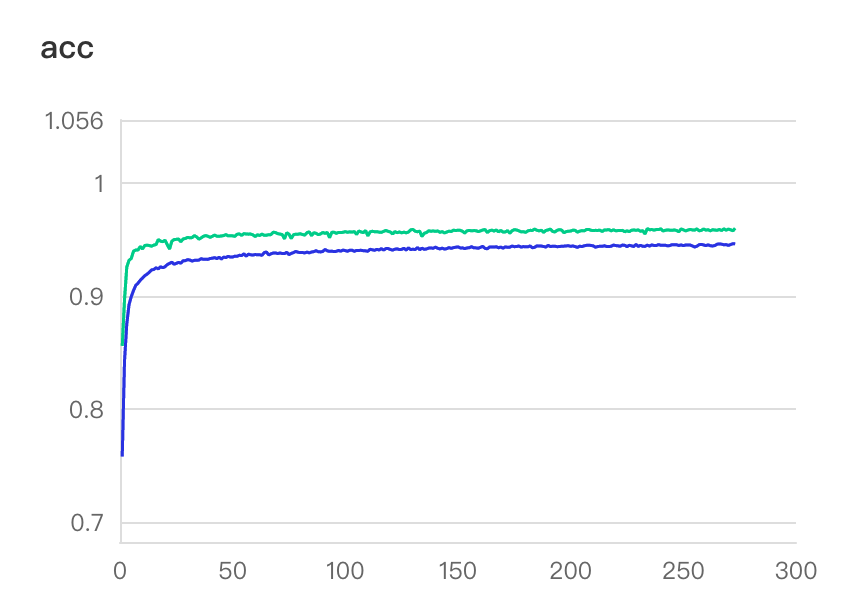
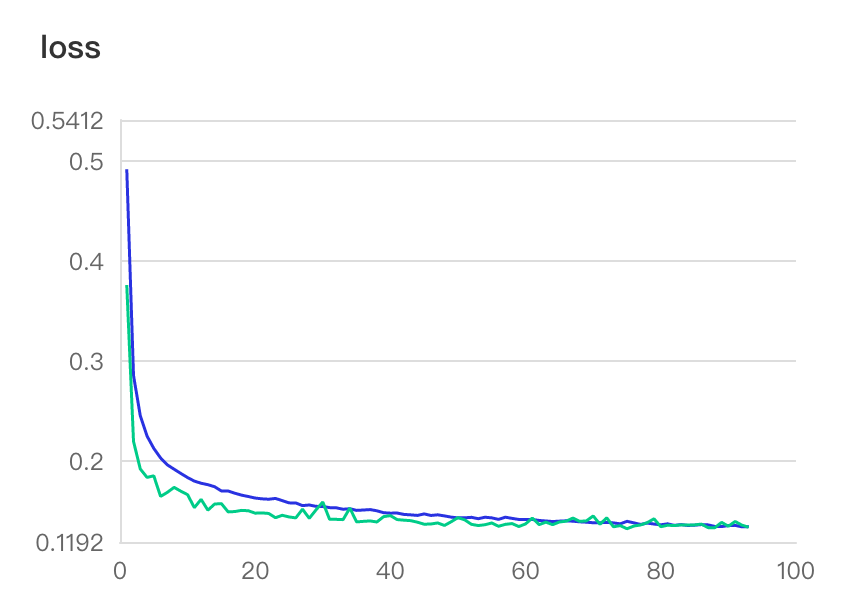
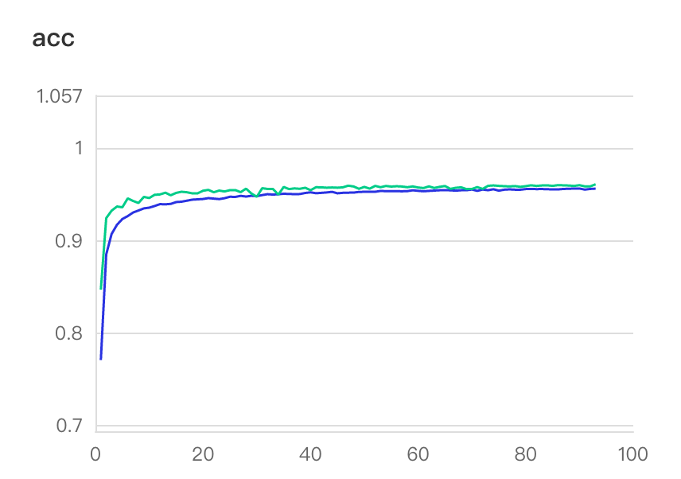

# 简介
通过PaddlePaddle框架复现了论文 [`Real-time Convolutional Neural Networks for Emotion and Gender Classification`](https://arxiv.org/pdf/1710.07557v1.pdf) 中提出的两个模型，分别是`SimpleCNN`和`MiniXception`。利用 `imdb_crop`数据集训练模型，进行人脸性别分类，准确率均达到96%。详细代码和模型已经发到比赛邮件里。
| 模型 | 准确率 | 输入尺寸 |
|  :---  | ----  | ----  |
| SimpleCNN | 96.00% | (48, 48, 3) |
| MiniXception | 96.01% | (64, 64, 1) |

# Requirements

```
scipy==1.2.1
paddlepaddle==2.1.2
numpy==1.20.1
opencv-python==3.4.10.37
pyyaml~=5.4.1
visualdl~=2.2.0
tqdm~=4.62.0
```

# 数据准备

我们在数据集[imdb_crop](https://pan.baidu.com/s/1xdFxhxcnO_5WyQh7URWMQA) (密码 `mu2h`)上训练模型，数据集也可以在[这里](https://data.vision.ee.ethz.ch/cvl/rrothe/imdb-wiki/)下载。下载和解压数据后，不用对数据再做别的处理了，编辑配置文件`conf.yaml`和`conf2.yaml`，两者分别是`SimpleCNN`和`MiniXception`的配置文件，把 `imdb_dir`设置成数据集所在的目录。不用划分训练集和测试集，程序会自动划分，即使你不训练只测试。我们采取的数据集划分方式和论文[作者的](https://github.com/oarriaga/face_classification)一样，先根据文件名对图片进行排序，前80%为训练集，后20%为测试集。

# 训练

在配置文件`conf.yaml`和`conf2.yaml`里进行相关配置，`mode`设置成`train`，其它选项根据个人情况配置。

执行脚本

```shell
python train_gender_classfifier.py path_to_conf
```
比如
```shell
python train_gender_classfifier.py ./conf.yaml
```

`path_to_conf` 是可选的，默认是 `./conf.yaml`，即训练`SimpleCNN`。

# 测试

在配置文件`conf.yaml`和`conf2.yaml`里进行相关配置，`mode`设置成`val`，另外要配置`model_state_dict`和`imdb_dir`。训练和测试的`imdb_dir`是一样的，都是数据集解压后所在的目录，不用对数据进行任何修改。训练和测试的`imdb_dir`虽然一样，但是训练和测试取的是数据集的不同部分，在上文的数据准备中有提到数据集划分的方式。

执行脚本

```shell
python train_gender_classfifier.py path_to_conf
```

等结果就行了。

# 指标可视化

你可以通过 `visuadl` 可视化训练过程中指标（比如损失、准确率等）的变化。可以在配置文件里设置日志的输出目录`log_dir`，在训练的过程中，每个epoch的准确率、损失、学习率的信息会写到日志中，分`train`和`val`两个文件夹。

当要查看指标时，执行以下命令

```
visualdl --logdir your_logdir --host 127.0.0.1
```

`your_logdir`是你设置的日志目录。

然后在浏览器中访问

http://127.0.0.1:8040/

下面展示我们的模型的指标曲线图。

## SimpleCNN





## MiniXception






